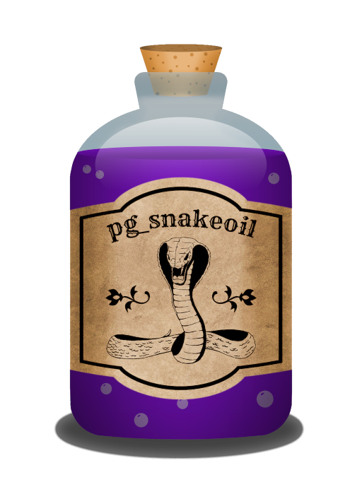

# pg_snakeoil - The PostgreSQL Antivirus



Running typical antivirus software on a PostgreSQL Server has severe
drawbacks such as severely affecting performance or making the system
no longer POSIX-compliant, which in turn is unsupported by the
community and threatens data consistency.  Further, the failure modes
are extremely problematic when a non-PostgreSQL-Aware scanner blocks
access to a file due to false-positives and bugs in the scanner
software.

We typically recommend not to run such software on PostgreSQL servers,
as PostgreSQL - in contrast to lesser software - knows how to discern
between code and data and will not execute any viruses stored in a
database.

Though, due to bureaucratical reasons, installing an antivirus cannot
be avoided by all of credativ's customers.  The motivation for
pg_snakeoil is to provide ClamAV scanning of all data entereing a
PostgreSQL in a way that does not interfere with the proper function
of PostgreSQL and does not cause collateral damage or unneccesary
downtimes.

## Usage

### SQL Functions

pg_snakeoil provides SQL functions to scan given data for viruses, ether manually or automated by e.g. triggers.
The following functions are implemented.

#### pg_snakeoil_find_virus (text) RETURNS bool

Returns true if the given data matches a signature in the virus database.
Will only show the virus name as a notice.

#### pg_snakeoil_virus_name (text) RETURNS text

Returns virus name if the given data matches a signature in the virus database, empty string otherwise.

### On Access (INSERT/UPDATE) scanning

Check data before it is accepted and stored into the Database.
Action on positive finding is customizable

### Scan via pg_logical

This is facilitated by using pg_receivelogical to acquire the data
entering the server instead of file system access, allowing offloading
of the CPU-time required for scanning to another server. The reaction
to a positive ClamAV result is fully customizable from asynchronous
notification of the admins or synchronous denial of a commit to the
application.


## Installation

### Compile

```bash
make
sudo make install
```

### Preload

pg_snakeoil can be loaded by each backend when needed.
Then an instance of the engine is started for every new backend.
This takes some time for the first function call after connecting!

To avoid this pg_snakeoil can be added to the  *shared_preload_libraries*.

```
shared_preload_libraries = 'pg_snakeoil' # (change requires restart)
```

### Create Extension

```SQL
CREATE EXTENSION pg_snakeoil;
```

## Examples

### Functions

#### Check Before Insert

```SQL
CREATE DOMAIN safe_text AS text CHECK (not pg_snakeoil_find_virus(value));

CREATE table t1(safe safe_text);
```

```SQL
INSERT INTO t1 VALUES ('This text is safe!');

INSERT INTO t1 VALUES('X5O!P%@AP[4\PZX54(P^)7CC)7}$EICAR-STANDARD-ANTIVIRUS-TEST-FILE!$H+H*'); -- test signature
```

Output

```bash
postgres=# INSERT INTO t1 VALUES('X5O!P%@AP[4\PZX54(P^)7CC)7}$EICAR-STANDARD-ANTIVIRUS-TEST-FILE!$H+H*'); -- test signature
NOTICE:  Virus found: Eicar-Test-Signature
ERROR:  value for domain safe_text violates check constraint "safe_text_check"
```
