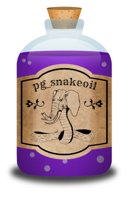

# pg_snakeoil - The PostgreSQL Antivirus



Running typical on-access antivirus software on a PostgreSQL server has severe
drawbacks such as severely affecting performance or making the filesystem
unreliable.  The failure modes are extremely problematic when a
non-PostgreSQL-aware scanner blocks access to a file due to viruses, or even
false-positives and bugs in the scanner software.

We typically recommend not to run such software on PostgreSQL servers, as
PostgreSQL knows how to discern between code and data and will not execute any
viruses stored in a database. However, running anti-virus software is sometimes
required by local policy.

pg_snakeoil provides ClamAV scanning of all data in PostgreSQL in a way that
does not interfere with the proper functioning of PostgreSQL and does not cause
collateral damage or unnecessary downtimes.

## Usage

### SQL Functions

pg_snakeoil provides SQL functions to scan given data for viruses. The
functions can be used manually or automatically, e.g. via triggers or check
constraints. The following functions are implemented:

#### so_is_infected (text) RETURNS bool

Returns true if the given data matches a signature in the virus database.

#### so_virus_name (text) RETURNS text

Returns virus name if the given data matches a signature in the virus database, empty string otherwise.

#### so_is_infected (bytea) RETURNS bool

Returns true if the given data matches a signature in the virus database.

#### so_virus_name (bytea) RETURNS text

Returns virus name if the given data matches a signature in the virus database,
NULL otherwise.


## Installation

### Compile

```bash
make PG_CONFIG=/path/to/pg_config
sudo make install
```

### Preload

pg_snakeoil is loaded by each PostgreSQL backend when needed.
An instance of the ClamAV engine is started for every new backend.
This takes several seconds for the first function call after connecting.

To avoid this, pg_snakeoil can be added to `shared_preload_libraries` in
`postgresql.conf`:

```
shared_preload_libraries = 'pg_snakeoil'
```

### Create Extension

In each database where pg_snakeoil is to be used, execute:

```SQL
CREATE EXTENSION pg_snakeoil;
```

## Examples

### Functions

#### Check Before Insert

```SQL
CREATE EXTENSION pg_snakeoil;
CREATE DOMAIN safe_text AS text CHECK (NOT so_is_infected(value));
CREATE TABLE t1(safe safe_text);


INSERT INTO t1 VALUES ('This text is safe!');
INSERT

INSERT INTO t1 VALUES('X5O!P%@AP[4\PZX54(P^)7CC)7}$EICAR-STANDARD-ANTIVIRUS-TEST-FILE!$H+H*');
NOTICE:  Virus found: Eicar-Test-Signature
ERROR:  value for domain safe_text violates check constraint "safe_text_check"
```

## Future Ideas

### Scan via pg_recvlogical

`pg_recvlogical` could be used to acquire the data entering the server
instead of file system access, allowing offloading of the CPU-time
required for scanning to another server. The reaction to a positive
ClamAV result is fully customizable from asynchronous notification of


